# Diagrama de Clases — Tank Wars

```mermaid
classDiagram
    %% ===== CLASES ABSTRACTAS Y BASE =====

    class Tank {
        <<abstract>>
        -__x: int
        -__y: int
        -__health: int
        -__direction: str
        -__speed: float
        -__bullet_damage: int
        #_color: tuple
        #_bullet_speed: int
        +move(direction, board) bool
        +shoot() Bullet
        +take_damage(damage) bool
        +is_alive() bool
        +get_position() tuple
        +get_direction() str
        +get_health() int
        +get_speed() float
        +get_damage() int
        +render(surface)* 
        -__validate_position(x, y) bool
        -__update_direction(direction)
        #_draw_tank(surface, color)
        #_set_position(x, y)
        #_set_direction(direction)
        #_set_health(health)
    }

    class PlayerTank {
        -__lives: int
        -__score: int
        -__shoot_cooldown: int
        -__shoot_cooldown_max: int
        +handle_input(board) Bullet
        +lose_life() bool
        +get_lives() int
        +add_score(points)
        +get_score() int
        +reset_position(x, y)
        +render(surface)
    }

    class EnemyTank {
        -__tank_type: str
        -__objective: tuple
        -__current_path: list
        -__path_index: int
        -__last_move_time: int
        -__last_prolog_time: int
        -__prolog_bridge: PrologBridge
        -__shoot_cooldown: int
        +set_objective(obj_x, obj_y)
        +request_new_path(board, player_pos, obj_pos)
        +update(board, player, objectives, time) Bullet
        +get_tank_type() str
        +render(surface)
        -__decide_action(player, objectives) str
        -__pick_target(player, objectives) tuple
        -__is_player_near(player) bool
        -__in_line_of_sight(player, board) bool
        -__aim_at_player(player)
        -__follow_path(board)
        -__calculate_manhattan_distance(x1,y1,x2,y2) int
        -__greedy_path(sx,sy,gx,gy,board) list
    }

    %% ===== ENTIDADES DEL MAPA =====

    class Objective {
        -__x: int
        -__y: int
        -__objective_type: str
        -__health: int
        -__max_health: int
        -__points_value: int
        -__is_destroyed: bool
        -__color: tuple
        -__flash_timer: int
        +take_damage(damage) bool
        +is_destroyed() bool
        +get_position() tuple
        +get_points() int
        +get_type() str
        +get_health() int
        +render(surface)
    }

    class Bullet {
        -__px: float
        -__py: float
        -__direction: str
        -__speed: int
        -__damage: int
        -__owner_type: str
        -__active: bool
        -__radius: int
        +update()
        +get_position() tuple
        +get_cell_position() tuple
        +get_damage() int
        +is_player_bullet() bool
        +is_active() bool
        +deactivate()
        +get_rect() Rect
        +render(surface)
    }

    class Wall {
        -__x: int
        -__y: int
        -__is_border: bool
        +get_position() tuple
        +is_border() bool
        +get_rect() Rect
        +render(surface)
    }

    %% ===== TABLERO =====

    class Board {
        -__grid: list
        -__walls: list
        -__objectives: list
        -__enemies: list
        -__bullets: list
        -__level: int
        -__player_start: tuple
        +load_level(level_number, prolog_bridge)
        +is_walkable(x, y) bool
        +is_wall(x, y) bool
        +get_all_free_cells() list
        +add_bullet(bullet)
        +update_bullets()
        +check_collisions(player) tuple
        +all_objectives_destroyed() bool
        +all_enemies_defeated() bool
        +objectives_intact() list
        +get_enemies() list
        +get_objectives() list
        +get_bullets() list
        +get_player_start() tuple
        +render(surface)
        -__parse_level_file(path) list
        -__build_from_grid(grid_data, prolog_bridge)
        -__generate_random_level(level_number) list
        -__check_bullet_wall_collision()
        -__check_bullet_tank_collision(player) tuple
        -__check_bullet_objective_collision() int
    }

    %% ===== CONTROLADOR =====

    class GameController {
        -__screen: Surface
        -__clock: Clock
        -__board: Board
        -__player: PlayerTank
        -__current_level: int
        -__game_state: str
        -__prolog_bridge: PrologBridge
        -__enemy_update_timer: int
        -__transition_timer: int
        -__transition_message: str
        +run()
        +start_game(level)
        +next_level()
        +game_over()
        -__update(dt)
        -__update_playing(dt)
        -__update_enemies(current_time)
        -__check_level_complete()
        -__show_transition(message, color, frames)
        -__update_transition(dt)
        -__render()
        -__render_menu()
        -__render_game()
        -__render_game_over()
        -__render_win()
        -__launch_editor()
    }

    %% ===== PUENTE PROLOG =====

    class PrologBridge {
        -__prolog: Prolog
        -__is_loaded: bool
        -__prolog_dir: str
        +load_knowledge_base() bool
        +is_loaded() bool
        +update_board_facts(board, player_pos, enemy_pos)
        +get_path(ex, ey, tx, ty) list
        +get_action(ex, ey, px, py, ox, oy) str
        +should_shoot(ex, ey, px, py) bool
        -__clear_dynamic_facts()
        -__assert_walls(board)
        -__assert_free_cells(board)
        -__assert_player_position(player_pos)
        -__parse_prolog_path(prolog_path) list
    }

    %% ===== EDITOR DE NIVELES =====

    class LevelEditor {
        -__screen: Surface
        -__clock: Clock
        -__grid: list
        -__selected_tile: str
        -__current_file: str
        -__message: str
        -__message_timer: int
        +run_editor()
        +load_level(path)
        +save_level(path) bool
        +show_level() list
        +edit_cell(x, y, tile)
        +validate_level() bool
        -__init_borders()
        -__handle_keydown(event) bool
        -__handle_click(event)
        -__handle_palette_click(mx, my)
        -__clear_grid()
        -__render_editor()
        -__render_palette()
    }

    %% ===== UI =====

    class Menu {
        -__screen: Surface
        -__font_title: Font
        -__font_large: Font
        -__font_medium: Font
        -__font_small: Font
        -__btn_play: Button
        -__btn_editor: Button
        -__btn_quit: Button
        -__btn_retry: Button
        -__btn_menu: Button
        -__particles: list
        -__tick: int
        +draw_main_menu() str
        +draw_game_over(score) str
        +draw_level_complete(level, score) str
        +draw_win_screen(score) str
        -__draw_animated_bg()
        -__draw_title(text, color, y)
        -__draw_subtitle(text, color, y)
        -__blit_center(text, font, color, y)
    }

    class HUD {
        -__screen: Surface
        -__font_main: Font
        -__font_small: Font
        -__hud_y: int
        -__prolog_active: bool
        -__flash_score: int
        -__last_score: int
        +set_prolog_status(active)
        +render(player, current_level, objectives_left)
        +show_message(text, color)
        -__draw_lives(lives)
    }

    class Button {
        +rect: Rect
        +text: str
        +color: tuple
        +hover_color: tuple
        +draw(surface)
        +is_clicked(event) bool
    }

    %% ===== RELACIONES =====

    Tank <|-- PlayerTank : hereda
    Tank <|-- EnemyTank  : hereda

    GameController "1" --> "1"  Board         : gestiona
    GameController "1" --> "1"  PlayerTank    : controla
    GameController "1" --> "1"  PrologBridge  : usa
    GameController "1" --> "1"  Menu          : renderiza
    GameController "1" --> "1"  HUD           : renderiza
    GameController "1" --> "1"  LevelEditor   : lanza

    Board "1" --> "*"  Wall       : contiene
    Board "1" --> "*"  Objective  : contiene
    Board "1" --> "*"  EnemyTank  : contiene
    Board "1" --> "*"  Bullet     : contiene

    EnemyTank "1" --> "0..1" PrologBridge : consulta
    EnemyTank "1" --> "*"    Bullet       : genera
    PlayerTank "1" --> "*"   Bullet       : genera

    Tank "1" --> "*" Bullet : dispara

    Menu "1" --> "*" Button : usa

    PrologBridge ..> Board : lee estado
```



## Descripción de relaciones

| Relación | Tipo | Descripción |
|---|---|---|
| `Tank ← PlayerTank` | Herencia | El jugador extiende la clase abstracta Tank |
| `Tank ← EnemyTank` | Herencia | Los enemigos extienden la clase abstracta Tank |
| `GameController → Board` | Composición | El controlador posee y gestiona el tablero |
| `GameController → PrologBridge` | Asociación | El controlador usa el puente Prolog |
| `EnemyTank → PrologBridge` | Dependencia | Los enemigos consultan Prolog para pathfinding y decisiones |
| `Board → {Wall, Objective, EnemyTank, Bullet}` | Composición | El tablero contiene todas las entidades |
| `Tank → Bullet` | Creación | Los tanques instancian balas al disparar |

## Estados del juego

```
MENU → PLAYING → LEVEL_TRANSITION → PLAYING (siguiente nivel)
                                  → WIN (último nivel)
              → GAME_OVER (sin vidas)
```
